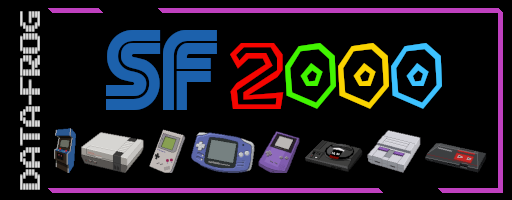

# SF2000 Bootlogo
Bootlogo for DataFrog's SF2000 device.

## Usage
The image must be used together with the device's bios file, in the tool [Data Frog SF2000 Boot Logo Changer](https://vonmillhausen.github.io/sf2000/tools/bootLogoChanger.htm) from colleague [vonmillhausen](https://github.com/vonmillhausen).
## Credits
#### Images of consoles
All consoles were hand-designed by [Rookervik](https://retropie.org.uk/about/systems/)
#### Fonts
ARCADE by [Glitch](https://www.fontspace.com/arcade-classic-font-f3284)

SEGA by [Unknown](https://freefontsvault.com/sega-font/)

SUPER MARIO BROS. by [Mario Monster](https://www.fontspace.com/super-mario-bros-font-f3396)
#### All images and fonts are property of their creators.
